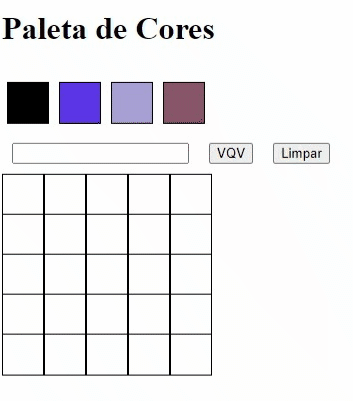

## Boas vindas ao repositório do projeto Arte com Pixels!

## Habilidades desenvolvidas nesse projeto

- Manipular o DOM

- Manipular o Javascript

---

## O que foi desenvolvido

Uma página web que contém uma paleta de cores funcional que poderá ser utilizada para criar desenhos em pixels. Para isto foram utilizados `javascript`, `css` e `html`.

